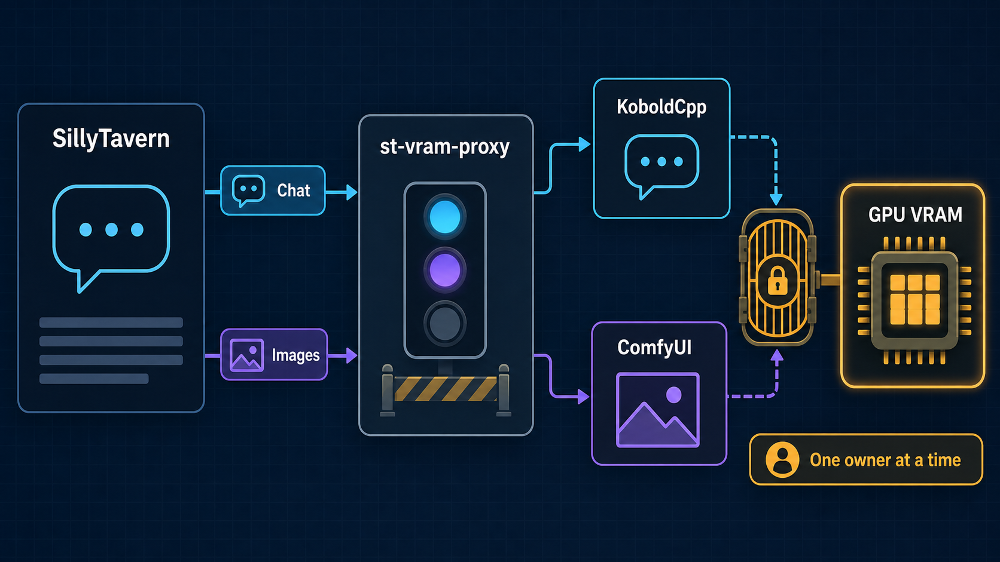
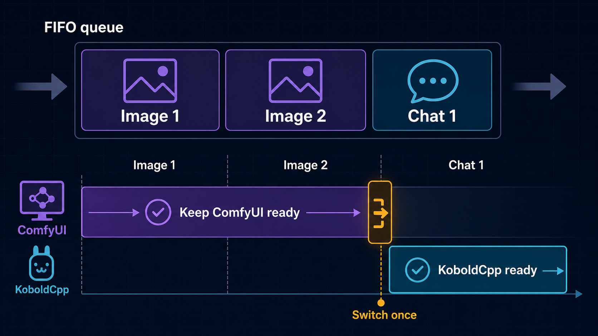

# st-vram-proxy user guide

`st-vram-proxy` lets SillyTavern use KoboldCpp for chat and ComfyUI for image
generation on a single GPU. It queues requests in arrival order and ensures
that only one backend owns GPU VRAM at a time.

This guide covers installation, first-time setup, everyday operation, status
monitoring, and troubleshooting.



## Who this guide is for

Use this guide if:

- SillyTavern, KoboldCpp, and ComfyUI run on the same computer.
- The KoboldCpp model and ComfyUI models do not comfortably fit in VRAM
  together.
- You want image and chat requests to wait safely instead of competing for
  memory.

The broker does not install or configure models for you. KoboldCpp and ComfyUI
must already work independently before you add the proxy.

## What the proxy does

SillyTavern connects to two proxy ports:

| Workload | SillyTavern connects to | Proxy forwards to |
| --- | --- | --- |
| Chat | `http://127.0.0.1:5001` | KoboldCpp at `http://127.0.0.1:5002` |
| Images | `http://127.0.0.1:8188` | ComfyUI at `http://127.0.0.1:8189` |

The proxy starts with KoboldCpp owning the GPU. When an image reaches the front
of the queue, it:

1. Stops starting newer chat requests.
2. Waits for active chats and streams to finish.
3. Unloads the KoboldCpp model and verifies that it is inactive.
4. Sends the image workflow to ComfyUI.
5. Leaves ComfyUI ready for any consecutive image requests.

When a chat reaches the front of the queue, it:

1. Waits for the active image to finish.
2. Asks ComfyUI to unload models and free memory.
3. Reloads KoboldCpp's startup model.
4. Verifies that the same model observed during startup is ready.
5. Starts the queued chat.

If no request is waiting, the current backend remains loaded. This avoids an
unnecessary unload/reload cycle after every image.



### FIFO examples

| Request order | Result |
| --- | --- |
| Image 1 → Image 2 → Chat 1 | One switch to ComfyUI, both images run, then one switch back to KoboldCpp |
| Image 1 → Chat 1 → Image 2 | Chat 1 runs between the images; Image 2 cannot overtake it |
| Chat 1 → Chat 2 → Image 1 | Both chats may run concurrently; the image waits until both finish |
| Image 1 → no new request | ComfyUI stays ready until a chat actually arrives |

## Requirements

- Python 3.11 or newer
- KoboldCpp with Model Administration enabled
- A KoboldCpp Admin/config directory
- ComfyUI running in API-compatible mode
- SillyTavern with KoboldCpp/KoboldAI and ComfyUI image-generation support
- All services listening on the local computer

Keep the proxy and both backend Admin/API ports on loopback
(`127.0.0.1` or `localhost`). Do not expose them directly to an untrusted
network.

## Before installation

Confirm that the backend ports are free and distinct:

| Component | Default role | Default port |
| --- | --- | --- |
| st-vram-proxy chat listener | SillyTavern chat destination | `5001` |
| KoboldCpp | Real chat backend | `5002` |
| st-vram-proxy image listener | SillyTavern image destination | `8188` |
| ComfyUI | Real image backend | `8189` |

If you choose different ports, update the backend commands, proxy command, and
SillyTavern settings together.

## Install st-vram-proxy

### Linux

From the repository directory:

```bash
python -m venv .venv
source .venv/bin/activate
python -m pip install -e .
```

After installation, confirm that the command is available:

```bash
st-vram-proxy --help
```

If you open a new terminal later, reactivate the environment:

```bash
source .venv/bin/activate
```

### Windows PowerShell

From the repository directory:

```powershell
py -3.11 -m venv .venv
.\.venv\Scripts\Activate.ps1
python -m pip install -e .
```

Confirm the installation:

```powershell
st-vram-proxy --help
```

If PowerShell blocks activation scripts, either adjust the execution policy for
your user account or run the executable directly:

```powershell
.\.venv\Scripts\st-vram-proxy.exe --help
```

## Configure and start the backends

Start the real backends before starting the proxy.

### 1. Configure KoboldCpp

KoboldCpp must:

- Listen on a port different from the proxy chat port.
- Have Model Administration enabled.
- Have a valid Admin/config directory.
- Expose the `unload_model` and `initial_model` Admin options.
- Start with the model you want restored after image generation.

Linux example:

```bash
./koboldcpp-linux-x64 \
  --model /path/to/model.gguf \
  --host 127.0.0.1 \
  --port 5002 \
  --admin \
  --admindir /path/to/kobold-admin-files
```

On Windows, configure the equivalent fields in the KoboldCpp GUI:

- Host: `127.0.0.1`
- Port: `5002`
- Admin: enabled
- Admin/config directory: a writable directory
- Startup model: the model that should return after ComfyUI finishes

If KoboldCpp Admin is password protected, put the password in the proxy
environment rather than on the command line.

Linux:

```bash
export ST_PROXY_KOBOLD_ADMIN_PASSWORD='replace-me'
```

Windows PowerShell:

```powershell
$env:ST_PROXY_KOBOLD_ADMIN_PASSWORD = 'replace-me'
```

### 2. Start ComfyUI

Linux example:

```bash
python main.py --listen 127.0.0.1 --port 8189
```

Windows portable example:

```powershell
.\python_embeded\python.exe ComfyUI\main.py --listen 127.0.0.1 --port 8189
```

Confirm that ComfyUI opens normally and that your intended SillyTavern workflow
can generate an image before introducing the proxy.

## Start the proxy

With the virtual environment active:

```bash
st-vram-proxy \
  --kobold-url http://127.0.0.1:5002 \
  --comfy-url http://127.0.0.1:8189 \
  --chat-port 5001 \
  --image-port 8188
```

Windows PowerShell uses the same options:

```powershell
st-vram-proxy `
  --kobold-url http://127.0.0.1:5002 `
  --comfy-url http://127.0.0.1:8189 `
  --chat-port 5001 `
  --image-port 8188
```

At startup, the proxy:

1. Verifies KoboldCpp Model Administration.
2. Calls ComfyUI `/free` to clear leftover image models.
3. Confirms that the KoboldCpp startup model is loaded.
4. Opens the two proxy listener ports.

A healthy startup ends with a log similar to:

```text
broker ready: chat=http://127.0.0.1:5001 image=http://127.0.0.1:8188 state=llm_ready
```

Leave this terminal running. Press `Ctrl+C` to stop the proxy cleanly. If
ComfyUI owns the GPU at shutdown, the proxy attempts to free ComfyUI and restore
KoboldCpp before exiting.

## Configure SillyTavern

### Chat connection

1. Open SillyTavern's API Connections panel.
2. Select KoboldCpp/KoboldAI.
3. Set the server URL to `http://127.0.0.1:5001`.
4. Connect normally.

### Image connection

1. Open the Image Generation extension settings.
2. Select ComfyUI.
3. Set the ComfyUI server URL to `http://127.0.0.1:8188`.
4. Select or configure the workflow you normally use.

SillyTavern should point to the proxy ports, not directly to KoboldCpp `5002`
or ComfyUI `8189`.

## Verify the setup

### 1. Check broker status

Linux:

```bash
curl http://127.0.0.1:5001/broker/status
```

Windows PowerShell:

```powershell
Invoke-RestMethod http://127.0.0.1:5001/broker/status
```

Immediately after startup, expect:

```json
{
  "state": "llm_ready",
  "gpu_owner": "llm",
  "active_chats": 0,
  "waiting_chats": 0,
  "waiting_images": 0,
  "active_prompt_id": null,
  "last_error": null,
  "chat_available": true
}
```

The status endpoint works on either proxy port.

### 2. Test chat

Send a short SillyTavern chat message. It should complete normally while the
status remains `llm_ready`.

### 3. Test image generation

Request one image. During the handoff, the state progresses through:

```text
draining_llm → unloading_llm → image_active → comfy_ready
```

After the image finishes, `gpu_owner` remains `comfy`. This is intentional.

### 4. Test the return to chat

Send another chat message. The state progresses through:

```text
cleaning_comfy → reloading_llm → llm_ready
```

The chat starts after the original KoboldCpp model is verified.

## Understand the status endpoint

### Status fields

| Field | Meaning |
| --- | --- |
| `state` | Current handoff or processing stage |
| `gpu_owner` | `llm`, `comfy`, or `null` while ownership is being changed or is unknown |
| `active_chats` | Chat requests currently using KoboldCpp |
| `waiting_chats` | Chat requests still waiting in the FIFO queue |
| `waiting_images` | Image requests still waiting in the FIFO queue |
| `active_prompt_id` | ComfyUI prompt currently being monitored, or `null` |
| `last_error` | Most recent controlled error or warning |
| `chat_available` | Whether the broker can accept chat requests; a value of `true` does not mean KoboldCpp is already loaded |

`waiting_chats` and `waiting_images` count queued work. The request currently
being activated or processed is not included in those counters.

### States

| State | Meaning |
| --- | --- |
| `initializing` | Coordinator is starting |
| `cleaning_comfy` | Proxy is asking ComfyUI to free models and memory |
| `verifying_llm` | Proxy is checking the startup KoboldCpp model |
| `llm_ready` | KoboldCpp owns the GPU and chat can start |
| `draining_llm` | Newer work is queued while active chats finish |
| `unloading_llm` | KoboldCpp is unloading its model |
| `comfy_ready` | ComfyUI owns the GPU and is idle between image jobs |
| `image_active` | A ComfyUI prompt is running |
| `reloading_llm` | KoboldCpp's startup model is being restored |
| `error` | GPU ownership or backend readiness could not be verified |
| `shutting_down` | Proxy is stopping and restoring a safe state |

## Everyday operation

- Start KoboldCpp and ComfyUI before the proxy.
- Keep the proxy running while SillyTavern is in use.
- A chat waiting behind images is normal.
- An image waiting for a streaming chat is normal.
- Consecutive images reuse the ComfyUI ownership period.
- Consecutive chats can run concurrently until an image reaches the front of
  the queue.
- Stop the proxy with `Ctrl+C` so it can restore KoboldCpp safely.
- Use `/broker/status` before restarting backends during a handoff.

## Configuration reference

Every command-line option has an `ST_PROXY_...` environment equivalent.
Command-line values override only their corresponding defaults supplied by the
environment.

| Command-line option | Environment variable | Default | Purpose |
| --- | --- | --- | --- |
| `--listen-host` | `ST_PROXY_LISTEN_HOST` | `127.0.0.1` | Address used by both proxy listeners |
| `--chat-port` | `ST_PROXY_CHAT_PORT` | `5001` | SillyTavern chat destination |
| `--image-port` | `ST_PROXY_IMAGE_PORT` | `8188` | SillyTavern image destination |
| `--kobold-url` | `ST_PROXY_KOBOLD_URL` | `http://127.0.0.1:5002` | Real KoboldCpp origin |
| `--comfy-url` | `ST_PROXY_COMFY_URL` | `http://127.0.0.1:8189` | Real ComfyUI origin |
| `--kobold-admin-password` | `ST_PROXY_KOBOLD_ADMIN_PASSWORD` | unset | KoboldCpp Admin bearer password |
| `--request-timeout` | `ST_PROXY_REQUEST_TIMEOUT` | `600` seconds | General upstream request timeout |
| `--image-timeout` | `ST_PROXY_IMAGE_TIMEOUT` | `1800` seconds | Maximum monitored image-job duration |
| `--chat-drain-timeout` | `ST_PROXY_CHAT_DRAIN_TIMEOUT` | `1800` seconds | Maximum wait for active chats to finish |
| `--unload-timeout` | `ST_PROXY_UNLOAD_TIMEOUT` | `180` seconds | Maximum KoboldCpp unload/verification time |
| `--reload-timeout` | `ST_PROXY_RELOAD_TIMEOUT` | `600` seconds | Maximum KoboldCpp reload/verification time |
| `--cleanup-timeout` | `ST_PROXY_CLEANUP_TIMEOUT` | `60` seconds | Maximum ComfyUI cleanup time |
| `--poll-interval` | `ST_PROXY_POLL_INTERVAL` | `0.5` seconds | Backend state polling interval |
| `--log-level` | `ST_PROXY_LOG_LEVEL` | `INFO` | Python logging level |

Example environment-only configuration on Linux:

```bash
export ST_PROXY_KOBOLD_URL=http://127.0.0.1:5002
export ST_PROXY_COMFY_URL=http://127.0.0.1:8189
export ST_PROXY_CHAT_PORT=5001
export ST_PROXY_IMAGE_PORT=8188
st-vram-proxy
```

## Troubleshooting

Start with two pieces of information:

```bash
curl http://127.0.0.1:5001/broker/status
```

Then read the proxy terminal around the most recent state transition. Logs do
not include prompts, generated content, request bodies, model names,
authorization values, or the Admin password.

### A chat or image appears to be waiting

Check:

- `state`
- `active_chats`
- `waiting_chats`
- `waiting_images`
- `active_prompt_id`

Waiting is expected when an earlier request owns the GPU. FIFO ordering means a
newer request never jumps ahead merely because its backend is already loaded.

If `active_chats` remains nonzero, a long-running or disconnected stream may
still be draining upstream. The proxy deliberately waits for upstream
generation to finish before unloading KoboldCpp.

### Startup reports Model Administration errors

Typical messages mention:

- `model administration check failed`
- `admin options check failed`
- required options missing
- Admin request rejected

Verify:

1. KoboldCpp Admin mode is enabled.
2. `--admindir` or the GUI Admin/config directory is valid.
3. The Admin password matches `ST_PROXY_KOBOLD_ADMIN_PASSWORD`.
4. KoboldCpp exposes both `unload_model` and `initial_model`.
5. You restarted KoboldCpp after changing its Admin configuration.

### Status remains `error`

The proxy fails closed when it cannot verify GPU ownership. Read `last_error`,
fix the backend problem, then restart the proxy. Do not bypass the proxy and
send work directly to both backends while ownership is uncertain.

### KoboldCpp unload times out

Symptoms include `confirmation of unloaded failed: timed out`.

Verify that:

- The Admin operation succeeds in KoboldCpp.
- `/api/v1/model` reports an inactive state after unload.
- KoboldCpp is responsive on the configured upstream port.
- The configured `--unload-timeout` is long enough for your system.

### KoboldCpp reload times out

Symptoms include `confirmation of loaded failed: timed out`.

The proxy requires the model after reload to match the model it observed at
startup. Check that:

- `initial_model` points to the intended startup model.
- The model file is still available.
- KoboldCpp has enough memory after ComfyUI cleanup.
- The configured `--reload-timeout` is long enough.

### ComfyUI image job times out

The proxy asks ComfyUI to interrupt the job, records the error, frees ComfyUI,
and restores KoboldCpp.

Check the ComfyUI console for workflow or node errors. Increase
`--image-timeout` only if the workflow is healthy but legitimately takes
longer.

### ComfyUI cleanup fails

The proxy records the cleanup failure and still attempts to restore KoboldCpp.
Check ComfyUI's `/free` support and console output. If KoboldCpp cannot reload,
the broker enters `error` and returns HTTP 503 for queued chat.

### HTTP 502 versus HTTP 503

| Response | Meaning |
| --- | --- |
| HTTP 502 | A normal proxied request to the selected backend failed |
| HTTP 503 | The broker rejected work because shutdown, initialization, or GPU ownership was not safely resolved |

### Port already in use

Choose four distinct ports or stop the process using the conflicting port.
Remember that SillyTavern uses the proxy ports while the proxy uses the backend
ports.

On Linux, inspect a port with:

```bash
ss -ltnp | grep ':5001'
```

On Windows PowerShell:

```powershell
Get-NetTCPConnection -LocalPort 5001
```

### SillyTavern bypasses the proxy

Recheck both SillyTavern URLs:

- Chat must use the proxy chat port.
- Images must use the proxy image port.

Do not configure SillyTavern with the real KoboldCpp or ComfyUI ports.

## Security and privacy

- Loopback is the safe default.
- Do not expose the KoboldCpp Admin API publicly.
- Do not expose ComfyUI or the proxy directly to an untrusted network.
- Store the Admin password in `ST_PROXY_KOBOLD_ADMIN_PASSWORD`.
- Avoid putting passwords on command lines where shell history or process
  listings may reveal them.
- Upstream URLs containing embedded credentials are rejected.
- Request bodies, prompts, generated content, model names, and authorization
  headers are not logged.

## Optional local stack supervisor

The repository includes `st-stack.zsh`, a Linux/Zsh supervisor tailored to the
repository owner's local multi-service setup. It can supervise KoboldCpp,
SillyTavern, PocketTTS, AllTalk, and the proxy. It does not start ComfyUI.

This script is not a portable default installation:

- Its application directories and launch commands are constants near the top
  of the script and must match your computer.
- Its default port layout differs from the standalone examples in this guide:
  it expects the real KoboldCpp and ComfyUI origins on `5001` and `8188`, and
  exposes the proxy on `5002` and `8189`.
- It requires Zsh and Linux process-management tools.

After adapting it to your environment:

```bash
./st-stack.zsh
```

Show child-process output:

```bash
./st-stack.zsh --log
```

Stop the supervised stack:

```bash
./st-stack.zsh --stop
```

Do not use the supervisor until you have reviewed its configured directories,
commands, ports, and shutdown behavior.

## Quick reference

Start order:

```text
1. KoboldCpp
2. ComfyUI
3. st-vram-proxy
4. SillyTavern connection
```

Default URLs:

```text
SillyTavern chat:   http://127.0.0.1:5001
KoboldCpp backend:  http://127.0.0.1:5002
SillyTavern images: http://127.0.0.1:8188
ComfyUI backend:    http://127.0.0.1:8189
Broker status:      http://127.0.0.1:5001/broker/status
```

Healthy idle states:

```text
llm_ready   — KoboldCpp owns the GPU
comfy_ready — ComfyUI owns the GPU
```

Safe stop:

```text
Press Ctrl+C in the proxy terminal.
```
